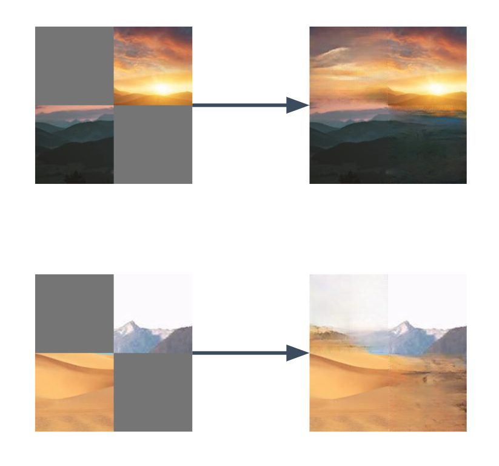
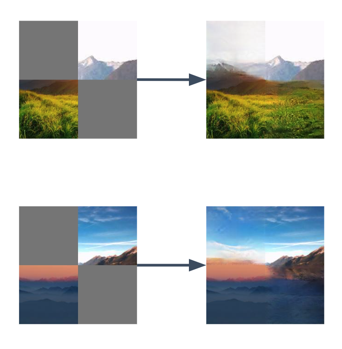
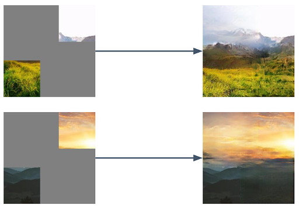

# GAN Paint

## Results







## Datasets

You can download the scenery dataset here: [https://github.com/z-x-yang/NS-Outpainting]

## Train

```bash
python main.py --mode train --epochs 30
```

## Train From Checkpoints

```bash
python main.py --mode train --checkpoint_path checkpoints/checkpoint_epoch_30.pth --epochs 50
```

## Eval

```bash
python main.py --mode eval --checkpoint_path checkpoints/checkpoint_epoch_55.pth --test_dir data-scenery-small-test
```

## Eval with Two Images

Note: You can directly input any image, our code will help you to crop

```bash
python main.py --mode eval_2 --checkpoint_path checkpoints/checkpoint_mask_0.4_epoch_55.pth --image2 data-scenery-small-test/original1.jpg --image1 data-scenery-small-test/pexels-stywo-1261728.jpg
```

## Comparison

### Diffusion-Non pretrained

```bash
python diffusion.py --mode train --epochs 30
python diffusion.py --mode train --checkpoint_path checkpoints/checkpoint_epoch_21.pth --epochs 100
python diffusion.py --mode eval --checkpoint_path checkpoints/checkpoint_epoch_21.pth --test_dir data-scenery-small-test
```

## Diffusion-Pretrained

Please see [ipynb](pretrained_diffusion.ipynb)
