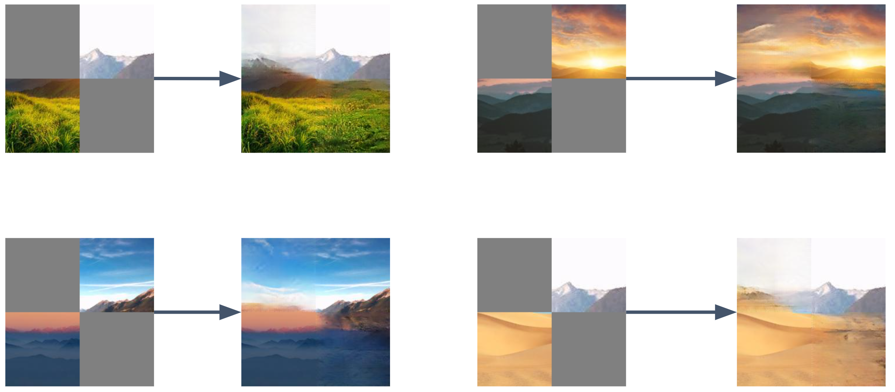

# GAN Paint: Image "Outpainting" and Hole Filling

## Introduction

Image completion tasks—like inpainting and outpainting—focus on seamlessly reconstructing or extending image regions. In our work, we generalize these concepts by filling a large gap between two distinct image patches. While pretrained diffusion models such as Stable Diffusion can achieve incredible results, they require large-scale resources and compute budgets. Our approach, by contrast, offers a practical, resource-friendly solution that:

- Uses a **U-Net** generator and **PatchGAN** discriminator.
- Achieves compelling results after just a few hours of training on a single **RTX 2070 GPU**.
- Combines **L1**, **SSIM**, **Perceptual**, and **Adversarial** losses to balance pixel accuracy, structural fidelity, and perceptual realism.

---

## Features

- **GAN-Based Completion**: A U-Net-based generator combines local and global context via skip connections, while a PatchGAN discriminator enforces realism at the patch level.
- **Minimal Training Cost**: Competitive performance without massive computational overhead.
- **Flexible Usage**: Works on single images, pairs of images from the same scene, or pairs from different scenes (cross-scene).
- **Easy to Extend**: Simple PyTorch-based code that can be adapted for various inpainting/outpainting tasks.

---

## Examples and Results

Below are example outputs where our model fills large missing regions:

| Result 1 | Result 2 |
|----------|----------|
|  |  |

| Result 3 | Result 4 |
|----------|----------|
|  |  |

Even with significantly masked areas, our GAN can synthesize coherent transitions.  

---

## Training Process


---

## Datasets

We primarily use the **NS-Outpainting** dataset, a collection of natural scenery images suitable for outpainting tasks.  

- **Download**: [NS-Outpainting dataset](https://github.com/z-x-yang/NS-Outpainting)
- Each image is typically resized and normalized to `[-1, 1]`.  
- Masking strategy: We create challenging partial inputs by cropping/occluding large regions (e.g., top-right and bottom-left quadrants).

---

## Usage

### Training

To **train** from scratch:

```bash
python main.py --mode train --epochs 30
```

### Resuming Training

If you have a **checkpoint** saved and wish to resume:

```bash
python main.py --mode train --checkpoint_path checkpoints/checkpoint_epoch_30.pth --epochs 50
```

### Evaluation

To **evaluate** on a test set:

```bash
python main.py --mode eval --checkpoint_path checkpoints/checkpoint_epoch_55.pth --test_dir data-scenery-small-test
```

### Evaluation with Two Images

We also provide a mode to **inpaint/outpaint** between **two** images:

```bash
python main.py --mode eval_2 \
    --checkpoint_path checkpoints/checkpoint_mask_0.4_epoch_55.pth \
    --image1 data-scenery-small-test/pexels-stywo-1261728.jpg \
    --image2 data-scenery-small-test/original1.jpg
```

---

## Comparison with Diffusion Models

To illustrate the computational advantage of our method, we also provide **diffusion-based** baselines.

### Diffusion (Non-Pretrained)

```bash
python diffusion.py --mode train --epochs 30
python diffusion.py --mode train --checkpoint_path checkpoints/checkpoint_epoch_21.pth --epochs 100
python diffusion.py --mode eval --checkpoint_path checkpoints/checkpoint_epoch_21.pth --test_dir data-scenery-small-test
```

These commands train/evaluate a non-pretrained diffusion model on the same dataset. Training diffusion models from scratch under limited resources tends to yield inferior results compared to our GAN approach.

### Diffusion (Pretrained)

We also tested a **pretrained Stable Diffusion** model. Given the substantial training cost (reportedly **\$600k**), it can generate highly photorealistic images, but this is often **out of reach** for smaller research labs. Please see the notebook [`pretrained_diffusion.ipynb`](pretrained_diffusion.ipynb) for details.

---

**Happy painting!** If you have any questions or run into issues, feel free to open an [issue](../../issues) or submit a [pull request](../../pulls). We welcome contributions!
